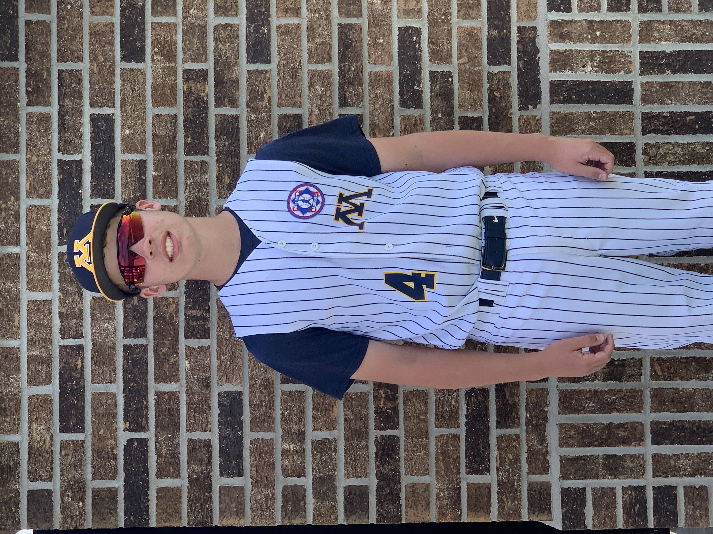
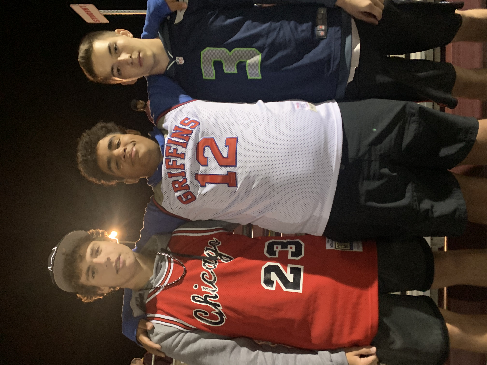

# AshtonSundhagen.github.io
<!doctype html>
<html>
<head>
<meta charset="utf-8">
<title>About Me</title>
<link href="style.css" rel="stylesheet" type="text/css">
</head>
<header class="masthead">
  
Hi I'm

  <h1 class="masthead-heading">ASHTON SUNDHAGEN!</h1>
</header>
<section class="introduction-section">
  <h1>Introduction</h1>
    
I am a student at Minot High School.

    
I like learning about technology, business, history.

</section>
<section class="location-section">
    <h1>Where I'm From</h1>
    
I'm originally from Minot, North Dakota and have lived here my whole life. 

</section>
<section class="questions-section">
    <h1>More About Me</h1>
    <h2>What are your favorite hobbies?</h2>
    
My favorite hobbies are basketball, baseball, football, and video games.

    <h2>What's your dream job?</h2>
    
My dream job has always being a professional athlete of some sort. If I had to chose I would be an NBA player.

    <h2>Where do you live?</h2>
    
I live about 5 minutes Southwest of Minot, North Dakota.

    <h2>Why do you want to be an NBA player?</h2>
    
Because I really love playing sports and being in the NBA would mean I could do what I love and make a living off of it.

</section>
<section class="pictures section">
	<h1>&nbsp; &nbsp; &nbsp; &nbsp; &nbsp; &nbsp; &nbsp; &nbsp; &nbsp; &nbsp; &nbsp; &nbsp; &nbsp; &nbsp; &nbsp; &nbsp; &nbsp; &nbsp; &nbsp; &nbsp; &nbsp; &nbsp; &nbsp; &nbsp; &nbsp; &nbsp; &nbsp; &nbsp; &nbsp; &nbsp; &nbsp; &nbsp; &nbsp; &nbsp; &nbsp; &nbsp; &nbsp; &nbsp; &nbsp; &nbsp; &nbsp; &nbsp; &nbsp; &nbsp; &nbsp; &nbsp; &nbsp; &nbsp; Pictures</h1>
&nbsp; &nbsp; &nbsp; &nbsp; &nbsp; &nbsp; &nbsp; &nbsp; &nbsp; &nbsp; &nbsp; &nbsp; &nbsp; &nbsp; &nbsp; &nbsp; &nbsp; &nbsp; &nbsp; &nbsp; &nbsp; &nbsp; &nbsp; &nbsp; &nbsp; &nbsp; &nbsp; &nbsp; &nbsp; &nbsp; &nbsp; &nbsp; &nbsp; &nbsp; &nbsp; &nbsp; &nbsp; &nbsp; &nbsp; &nbsp; &nbsp; &nbsp; &nbsp; &nbsp; &nbsp; &nbsp; &nbsp; &nbsp; &nbsp; &nbsp; &nbsp; &nbsp; &nbsp; &nbsp; &nbsp; &nbsp; &nbsp; &nbsp; &nbsp; &nbsp; &nbsp; &nbsp; &nbsp; &nbsp; &nbsp; &nbsp; &nbsp; &nbsp; &nbsp; &nbsp; &nbsp; &nbsp; &nbsp; &nbsp; &nbsp; &nbsp; &nbsp; &nbsp; &nbsp; &nbsp; &nbsp; &nbsp; &nbsp; &nbsp; &nbsp; &nbsp; &nbsp; &nbsp; &nbsp; &nbsp; &nbsp;
	&nbsp; &nbsp; &nbsp; &nbsp; &nbsp; &nbsp; &nbsp; &nbsp; &nbsp; &nbsp; &nbsp; &nbsp; &nbsp; &nbsp; &nbsp; &nbsp; &nbsp; &nbsp; &nbsp; &nbsp; &nbsp;
	</section>
	 

</html> 
